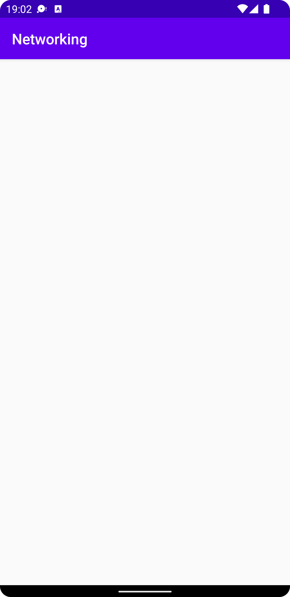
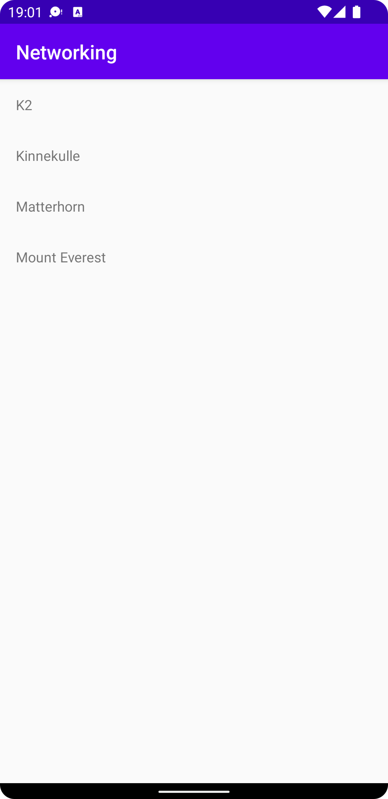

# Rapport

### RecyclerView + RecyclerView.Adapter

Till en början skapades och initerades de olika delarna i appen: RecyclerView och RecyclerView.Adapter. En RecyclerView skapades i layout filen för MainActivity medans en ny layout.xml fil skapades för att representera en rad i RecyclerViewen. Efter att dessa skapats i xml behövde de också referas i alla java-classer. En adapter för Recycleviewen är _MountainAdapter_, en class som extendar RecycleView.Adapter. Denna adapter håller i en referens till en lista med alla Mountain objekt som skapas med classen _MountainListItem_. Det är dessa objekt som populeras i en _listitem_layout_. 

För att sedan kunna populera listan med data anropades en extern url med en GET request för att hämta json-data. För att detta skulle vara möjligt behövdes följande rad med kod läggas till: 

```xml
<uses-permission android:name="android.permission.INTERNET" />
```

### Json

När data skulle hämtas från den externa källan på urlen _https://mobprog.webug.se/json-api?login=brom_, uppstod flera problem. Dessa problem kunde relativt enkelt lösas med hjälp av debugging av loggen. Det första problemet var att responsen blev null vilket resulterade i att `onPostExecute(String json)` som innehöll funktionen `Log.d("tag", json)` throwade en execption då json hade värdet null. Denna ändrades så att den inte crashade appen vi null. Det andra problemet som uppstod var att SSL handskakningen inte lyckades. Detta eftersom emulatorns tid och datum var satt till 1 April 2022. Genom att manuellt ändra tiden till dagens datum (26/4/22) lyckades handskakningen och appen kunde hämta json-stringen från den externa urlen. 

När json-stringen hämtats från servern, omvandlades den till en lista av objekt av classen _MountainListItem_ varpå listan lades till i _mountains_, den lista som Adaptern har referns till. För att sedan uppdatera appen med den nya datan kallades funktionen `mountainAdapter.notifyDataSetChanged()`. Detta går att se i kodblocket nedan:

```java
@Override
public void onPostExecute(String json) {
    Gson gson = new Gson();
    Type type = new TypeToken<ArrayList<MountainListItem>>() {}.getType();

    Log.d("Response", String.format("Got response from GET: %b", json != null));

    ArrayList<MountainListItem> newMountains =  gson.fromJson(json, type);

    mountains.addAll(newMountains);
    mountainAdapter.notifyDataSetChanged();
}
```

### Resultat

#### Innan datan har hämtats



#### Datan har hämtats och RecyclerViewen har uppdaterats


